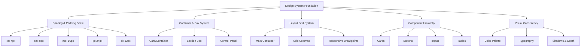

# Design Document: UI/UX Redesign System

## Overview

Comprehensive design system untuk seluruh aplikasi API Formula Tools yang mencakup GIGA PANEL TOOLS, QRIS HOKI TOOLS, dan GIGA SMART MUTASI TOOLS. Sistem ini menetapkan standar konsisten untuk spacing, padding, layout grid, dan visual hierarchy di semua section/panel. Tujuan utama adalah menghilangkan tampilan "menumpuk" dan menciptakan profesionalisme visual yang seragam.

## Architecture



## Components and Interfaces

### 1. Spacing & Padding System

**Standardized Scale (in pixels and Tailwind units)**:

```
xs:  4px   (0.25rem)  - Minimal spacing, icon gaps
sm:  8px   (0.5rem)   - Tight spacing, small components
md:  16px  (1rem)     - Standard spacing, most elements
lg:  24px  (1.5rem)   - Generous spacing, section separation
xl:  32px  (2rem)     - Large spacing, major sections
xxl: 48px  (3rem)     - Extra large, page-level spacing
```

**Application Rules**:

- **Horizontal Padding**: All containers use `px-md` (16px) as minimum
- **Vertical Padding**: All containers use `py-md` (16px) as minimum
- **Gap Between Elements**: Use `gap-md` (16px) for flex/grid layouts
- **Section Separation**: Use `gap-lg` (24px) between major sections
- **Nested Elements**: Reduce padding by one level (e.g., md → sm)

### 2. Container & Box Design

**Base Container Specifications**:

```
Border Radius:  0.625rem (10px) - Standard
                0.875rem (14px) - Large containers
                1.25rem  (20px) - Extra large sections

Border:         1px solid rgba(255, 255, 255, 0.1)
                Hover: rgba(255, 255, 255, 0.15)

Shadow:         shadow-sm: 0 1px 2px rgba(0, 0, 0, 0.05)
                shadow-md: 0 4px 6px rgba(0, 0, 0, 0.1)
                shadow-lg: 0 10px 15px rgba(0, 0, 0, 0.1)

Background:     bg-slate-950/45 (default)
                bg-white/5 (glass effect)
                bg-white/10 (hover state)

Padding:        Card: px-lg py-lg (24px)
                Section: px-md py-md (16px)
                Control: px-md py-sm (16px / 8px)
```

**Container Hierarchy**:

1. **Page Container** (outermost)
   - Padding: `px-6 py-10` (24px / 40px)
   - Max-width: `max-w-5xl`
   - Gap: `gap-6` (24px)

2. **Section Container** (major sections)
   - Padding: `px-lg py-lg` (24px)
   - Border-radius: `rounded-2xl` (20px)
   - Gap: `gap-lg` (24px)
   - Background: `glass` effect

3. **Card/Box Container** (sub-sections)
   - Padding: `px-md py-md` (16px)
   - Border-radius: `rounded-xl` (16px)
   - Gap: `gap-md` (16px)
   - Background: `bg-white/5`

4. **Control Panel** (inputs, buttons)
   - Padding: `px-md py-sm` (16px / 8px)
   - Border-radius: `rounded-lg` (12px)
   - Gap: `gap-sm` (8px)
   - Background: `bg-white/5`

### 3. Layout Grid System

**Main Layout Structure**:

```
┌─────────────────────────────────────────────────────┐
│  HEADER (sticky, z-30)                              │
│  - Logo + Title: flex gap-4                         │
│  - Category Tabs: grid grid-cols-3 gap-1.5          │
└─────────────────────────────────────────────────────┘

┌─────────────────────────────────────────────────────┐
│  MAIN CONTENT (max-w-5xl, mx-auto)                  │
│  ┌───────────────────────────────────────────────┐  │
│  │ Sub-Tab Switcher (self-start)                 │  │
│  └───────────────────────────────────────────────┘  │
│                                                      │
│  ┌───────────────────────────────────────────────┐  │
│  │ Section 1: Upload Zone                        │  │
│  │ - Padding: px-12 py-12                        │  │
│  │ - Border: border-2 border-dashed              │  │
│  └───────────────────────────────────────────────┘  │
│                                                      │
│  ┌───────────────────────────────────────────────┐  │
│  │ Section 2: Controls Panel                     │  │
│  │ - Grid: grid-cols-1 md:grid-cols-2 lg:grid-cols-3 │
│  │ - Gap: gap-md (16px)                          │  │
│  │ - Each Control: px-md py-sm                   │  │
│  └───────────────────────────────────────────────┘  │
│                                                      │
│  ┌───────────────────────────────────────────────┐  │
│  │ Section 3: Stats Cards                        │  │
│  │ - Grid: grid-cols-1 sm:grid-cols-2 lg:grid-cols-3 │
│  │ - Gap: gap-md (16px)                          │  │
│  │ - Each Card: px-lg py-lg                      │  │
│  └───────────────────────────────────────────────┘  │
│                                                      │
│  ┌───────────────────────────────────────────────┐  │
│  │ Section 4: Data Table                         │  │
│  │ - Padding: px-lg py-lg                        │  │
│  │ - Overflow: overflow-x-auto                   │  │
│  └───────────────────────────────────────────────┘  │
└─────────────────────────────────────────────────────┘
```

**Responsive Breakpoints**:

```
Mobile (< 640px):
  - Single column layouts
  - Padding: px-4 py-6
  - Font sizes: reduced by 1 step
  - Gap: gap-sm (8px)

Tablet (640px - 1024px):
  - 2-column layouts where applicable
  - Padding: px-6 py-8
  - Gap: gap-md (16px)

Desktop (> 1024px):
  - 3-column layouts
  - Padding: px-6 py-10
  - Gap: gap-lg (24px)
```

### 4. Component Hierarchy

#### 4.1 Cards

**Standard Card**:
```
┌─────────────────────────────────┐
│ ┌─────────────────────────────┐ │
│ │ Card Header (optional)      │ │ py-sm (8px)
│ ├─────────────────────────────┤ │ border-b border-white/10
│ │                             │ │
│ │ Card Content                │ │ py-md (16px)
│ │ - Padding: px-md py-md      │ │
│ │ - Gap: gap-md               │ │
│ │                             │ │
│ └─────────────────────────────┘ │
└─────────────────────────────────┘

Outer: px-lg py-lg (24px)
Inner: px-md py-md (16px)
```

**Stat Card**:
```
┌──────────────────────────┐
│ Icon (top-right)         │
│                          │
│ Label (text-xs)          │ py-sm (8px)
│ Value (text-2xl bold)    │ py-sm (8px)
│ Subtitle (text-xs muted) │ py-sm (8px)
└──────────────────────────┘

Padding: px-lg py-lg (24px)
Gap: gap-sm (8px)
```

#### 4.2 Buttons

**Button Sizes**:

```
Small (xs):
  - Height: h-8 (32px)
  - Padding: px-2.5 py-1 (10px / 4px)
  - Font: text-xs
  - Gap: gap-1.5 (6px)
  - Border-radius: rounded-lg (12px)

Medium (sm):
  - Height: h-10 (40px)
  - Padding: px-4 py-2.5 (16px / 10px)
  - Font: text-sm
  - Gap: gap-2 (8px)
  - Border-radius: rounded-xl (16px)

Large (md):
  - Height: h-12 (48px)
  - Padding: px-6 py-3 (24px / 12px)
  - Font: text-base
  - Gap: gap-2.5 (10px)
  - Border-radius: rounded-xl (16px)
```

**Button States**:

```
Default:
  - Border: border-white/10
  - Text: text-white/50
  - Hover: bg-white/5 border-white/20 text-white/80

Active:
  - Background: bg-violet-600
  - Border: border-violet-500
  - Text: text-white
  - Shadow: shadow-md shadow-violet-500/30

Disabled:
  - Opacity: opacity-35
  - Cursor: cursor-not-allowed
```

#### 4.3 Input Fields

**Input Specifications**:

```
Height: h-10 (40px)
Padding: px-3 py-2 (12px / 8px)
Font: text-sm
Border-radius: rounded-lg (12px)

Background: bg-white/5
Border: border border-white/10
Focus: 
  - Ring: focus:ring-1 focus:ring-violet-400/50
  - Border: focus:border-violet-400/40
  - Transition: transition-all

Placeholder: placeholder:text-white/25
```

**Input Group** (label + input):

```
┌──────────────────────────┐
│ Label (text-xs font-medium) │ mb-sm (8px)
│ ┌────────────────────────┐ │
│ │ Input Field            │ │
│ └────────────────────────┘ │
│ Helper Text (optional)     │ mt-xs (4px)
└──────────────────────────┘

Gap: gap-sm (8px)
```

#### 4.4 Tables

**Table Structure**:

```
┌─────────────────────────────────────────────────┐
│ Table Header                                    │
│ ┌─────────────────────────────────────────────┐ │
│ │ Col 1 | Col 2 | Col 3 | Col 4 | Col 5      │ │
│ └─────────────────────────────────────────────┘ │
│ ┌─────────────────────────────────────────────┐ │
│ │ Row 1 Data                                  │ │
│ ├─────────────────────────────────────────────┤ │
│ │ Row 2 Data                                  │ │
│ ├─────────────────────────────────────────────┤ │
│ │ Row 3 Data                                  │ │
│ └─────────────────────────────────────────────┘ │
└─────────────────────────────────────────────────┘

Header:
  - Padding: px-md py-sm (16px / 8px)
  - Background: bg-white/5
  - Border-bottom: border-b border-white/10
  - Font: text-xs font-semibold uppercase

Row:
  - Padding: px-md py-md (16px)
  - Border-bottom: border-b border-white/10
  - Hover: bg-white/5 transition-colors

Cell:
  - Padding: px-sm py-md (8px / 16px)
  - Text: text-sm
```

### 5. Visual Consistency

#### 5.1 Color Palette

**Primary Colors**:
```
Primary:        hsl(248 80% 68%)  - Violet
Primary Dark:   hsl(248 50% 22%)  - Accent
Secondary:      hsl(238 28% 16%)  - Dark slate

Success:        hsl(175 70% 48%)  - Teal
Warning:        hsl(35 90% 58%)   - Amber
Danger:         hsl(0 65% 50%)    - Red
```

**Neutral Colors**:
```
Background:     hsl(238 35% 7%)   - Deep indigo
Card:           hsl(238 30% 10%)  - Slightly lighter
Border:         hsl(238 28% 18%)  - Light border
Text Primary:   hsl(240 25% 93%)  - Off-white
Text Secondary: hsl(238 18% 52%)  - Muted
```

#### 5.2 Typography

**Font Family**: Inter (sans-serif)

**Font Sizes & Weights**:

```
Display:        text-3xl font-bold (30px)
Heading 1:      text-2xl font-bold (24px)
Heading 2:      text-xl font-semibold (20px)
Heading 3:      text-lg font-semibold (18px)

Body Large:     text-base font-normal (16px)
Body:           text-sm font-normal (14px)
Body Small:     text-xs font-normal (12px)

Label:          text-xs font-medium (12px)
Caption:        text-xs font-normal (12px)

Button:         text-sm font-semibold (14px)
Button Small:   text-xs font-semibold (12px)
```

**Line Heights**:
```
Tight:          leading-tight (1.25)
Normal:         leading-normal (1.5)
Relaxed:        leading-relaxed (1.625)
Loose:          leading-loose (2)
```

#### 5.3 Shadows & Depth

**Shadow Scale**:

```
None:           shadow-none
Small:          shadow-sm (0 1px 2px rgba(0,0,0,0.05))
Medium:         shadow-md (0 4px 6px rgba(0,0,0,0.1))
Large:          shadow-lg (0 10px 15px rgba(0,0,0,0.1))
Extra Large:    shadow-xl (0 20px 25px rgba(0,0,0,0.1))

Colored Shadows:
  Violet:       shadow-violet-500/30
  Emerald:      shadow-emerald-500/30
  Amber:        shadow-amber-500/30
  Red:          shadow-red-500/30
```

**Depth Levels**:

```
Level 0 (Background):   No shadow, z-0
Level 1 (Cards):        shadow-sm, z-10
Level 2 (Modals):       shadow-lg, z-50
Level 3 (Tooltips):     shadow-md, z-40
Level 4 (Dropdowns):    shadow-md, z-30
```

## Data Models

### Spacing Token

```
interface SpacingToken {
  xs:   "4px"   // 0.25rem
  sm:   "8px"   // 0.5rem
  md:   "16px"  // 1rem
  lg:   "24px"  // 1.5rem
  xl:   "32px"  // 2rem
  xxl:  "48px"  // 3rem
}
```

### Container Specification

```
interface ContainerSpec {
  padding:      string        // px-md py-md
  borderRadius: string        // rounded-xl
  border:       string        // border border-white/10
  background:   string        // bg-white/5
  shadow:       string        // shadow-sm
  gap:          string        // gap-md
  maxWidth:     string        // max-w-5xl
}
```

### Component Variant

```
interface ComponentVariant {
  size:         "xs" | "sm" | "md" | "lg"
  state:        "default" | "hover" | "active" | "disabled"
  padding:      string
  height:       string
  fontSize:     string
  borderRadius: string
  gap:          string
}
```

## Error Handling

### Spacing Violations

**Condition**: Element padding/margin deviates from standard scale
**Response**: Apply nearest standard spacing value
**Recovery**: Document deviation and update design token

### Container Inconsistency

**Condition**: Container has mismatched padding or border-radius
**Response**: Normalize to appropriate container level
**Recovery**: Apply consistent styling across all instances

### Responsive Breakpoint Issues

**Condition**: Layout breaks at specific viewport sizes
**Response**: Adjust grid columns and padding for breakpoint
**Recovery**: Test across all breakpoints (mobile, tablet, desktop)

## Testing Strategy

### Unit Testing Approach

- Verify spacing values match design tokens
- Validate container padding consistency
- Check border-radius standardization
- Confirm color values match palette

### Property-Based Testing Approach

**Property Test Library**: fast-check

**Properties to Test**:

1. **Spacing Consistency**: All padding values are multiples of 4px
2. **Container Hierarchy**: Nested containers maintain padding relationships
3. **Responsive Scaling**: Padding scales appropriately across breakpoints
4. **Color Contrast**: Text colors maintain minimum contrast ratios
5. **Shadow Depth**: Shadow values correspond to z-index levels

### Integration Testing Approach

- Test spacing across all panels (QRIS HOKI, GIGA, GIGA SMART MUTASI)
- Verify layout consistency when switching between sections
- Validate responsive behavior on mobile, tablet, desktop
- Check visual alignment of components across different screen sizes

## Performance Considerations

- Use CSS classes instead of inline styles for better caching
- Leverage Tailwind's utility classes for consistent spacing
- Minimize layout shifts by pre-defining container dimensions
- Use CSS Grid for complex layouts to reduce DOM nesting

## Security Considerations

- Ensure color contrast meets WCAG AA standards (4.5:1 for text)
- Validate all user input in form fields
- Sanitize any dynamic content in containers
- Use semantic HTML for accessibility

## Dependencies

- Tailwind CSS (for utility classes)
- Framer Motion (for animations)
- Lucide React (for icons)
- Sonner (for toast notifications)
- React Query (for data fetching)
